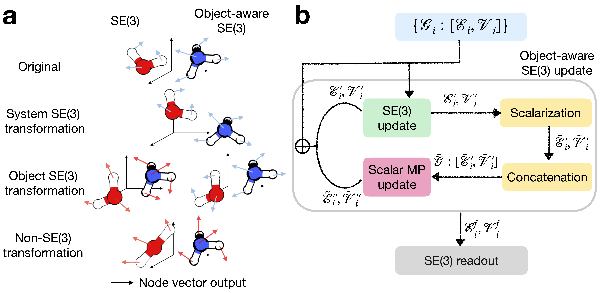

OA-ReactDiff
==============================
[//]: # (Badges)
[](https://github.com/chenruduan/OAReactDiff/actions?query=workflow%3ACI)

### <ins>O</ins>bject-<ins>a</ins>ware SE(3) GNN for generating chemical <ins>react</ins>ions under <ins>diff</ins>usion model (OA-ReactDiff)

*OA-ReactDiff* is the first diffusion-based generative model for generating  **3D chemical reactions**, which not only accelerates the search for 3D transition state in chemical reactions by **a factor of 1000**, but also generates and explores **new and unknown** chemical reactions.

Recently, the framework of DDPM has been progressively applied to tasks related to chemical molecules. Examples include generating [3D structures of organic small molecules](https://arxiv.org/abs/2203.17003), [protein-small molecule docking](https://arxiv.org/abs/2210.01776), and [protein structure-based drug design](https://arxiv.org/abs/2210.13695) (Figure 1a). Here we present OA-ReactDiff, a model directly generates the core concept of chemistry, elementary chemical reactions. OA-ReactDiff does so by diffusing and denoising three 3D structures in a reaction, i.e., reactant, transition state, and product, all together (Figure 1b).

<div>
    
    <p style='font-size:1rem; font-weight:bold'>Figure 1｜DDPM for generating a molecule and a reaction</p>
</div>

Sounds easy? There is one caveat! Conventional SE(3) won't apply here. Why? Three structures in a reaction follows a higher **"object-wise"** SE(3) symmetry instead of a "system-wise" SE(3) symmetry (Figure 2a). For example, any SE(3) transformation on a object (e.g., a molecule in reactant) should not change the nature of the chemical reaction of study. To tackle this problem, we develop a simple way to realize "object-wise" SE(3) symmetry by mixing a conventional SE(3) update and scalar message passing layer (Figure 2b). This protocol is general to many SE(3) graph neural networks taht are still under active development. At this point, we use [LEFTNet](https://arxiv.org/abs/2304.04757), a SOTA-level SE(3) graph neural network in OA-ReactDiff.

<div>
    
    <p style='font-size:1rem; font-weight:bold'>Figure 2｜Object-wise SE(3) and our implementation</p>
</div>

Since OA-ReactDiff maintains **all symmetries and constraints** in chemical reactions, it does not require any pre-processing (e.g., atom mapping, fragment alignment) and post-processting (e.g., coverting distance matrix to 3D geometry), which sometimes are infeasible in exploring unknown reactions. OA-ReactDiff reduces the transition state search cost **from days in using density functional theory to seconds**. Due to the stochastic nature of DDPM, OA-ReactDiff can generate unintended reactions "beyond design", **complementing the chemical intuition-based reaction exploration** that people have been using for decades.


### Want to learn more? 
Get a deep dive with our notebook tutorial at `OA-ReactDiff.ipynb` after installing the package or start with our docker container.

### Installation
1. Clone this repo `git clone git@github.com:chenruduan/OAReactDiff.git` and `cd OAReactDiff`  
2. Setup a conda environment with the proived yaml file `conda env create -f env.yaml`
3. Local package installation `conda activate oa_reactdiff && pip install -e .`
4. Test everything works as expected by `pytest oa_reactdiff/tests/`

### Docker container
If you are familiar with containerization and would like to use it in your projects, we prepared docker containers for both cpu-only machine and gpu machine at [DockerHub](https://hub.docker.com/r/chenruduan/oa_reactdiff/tags).


### Citation
```
@misc{Duan2023OAReactDiff,
    title={Accurate transition state generation with an object-aware equivariant elementary reaction diffusion model}, 
    author={Chenru Duan and Yuanqi Du and Haojun Jia and Heather J. Kulik},
    year={2023},
    eprint={2304.06174},
    archivePrefix={arXiv},
}

@Article{OA-ReactDiff,
    author={Duan, Chenru
    and Du, Yuanqi
    and Jia, Haojun
    and Kulik, Heather J.},
    title={Accurate transition state generation with an object-aware equivariant elementary reaction diffusion model},
    journal={Nature Computational Science},
    year={2023},
    month={Dec},
    day={01},
    volume={3},
    number={12},
    pages={1045-1055},
    doi={10.1038/s43588-023-00563-7},
    url={https://doi.org/10.1038/s43588-023-00563-7}
}
```


### Copyright

Copyright (c) 2023, Chenru Duan


### Acknowledgements

Code development based on
1. [Computational Molecular Science Python Cookiecutter](https://github.com/molssi/cookiecutter-cms) version 1.1.
2. [LEFTNet](https://github.com/yuanqidu/LeftNet)
3. [e3_diffusion_for_molecules](https://github.com/ehoogeboom/e3_diffusion_for_molecules)
4. [DiffSBDD](https://github.com/arneschneuing/DiffSBDD)
